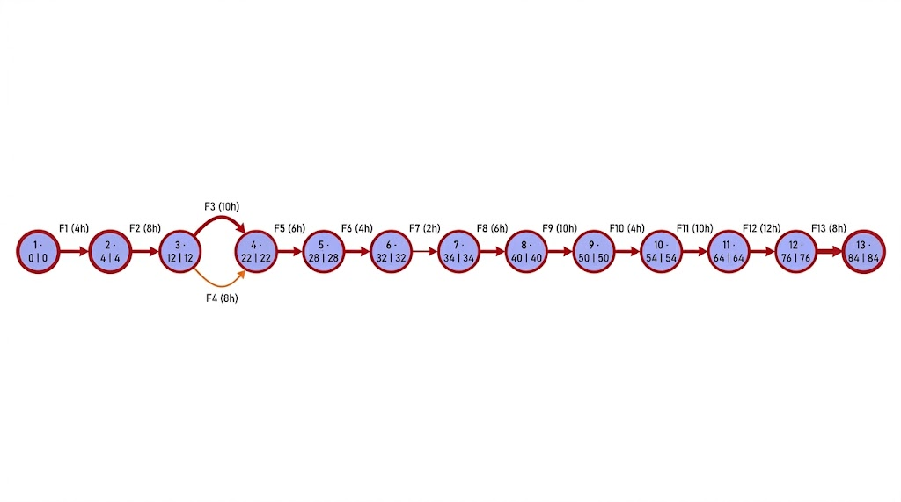
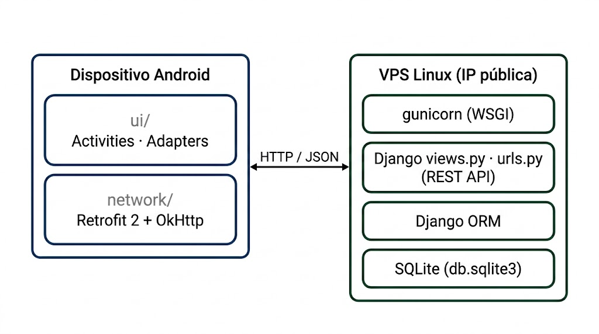
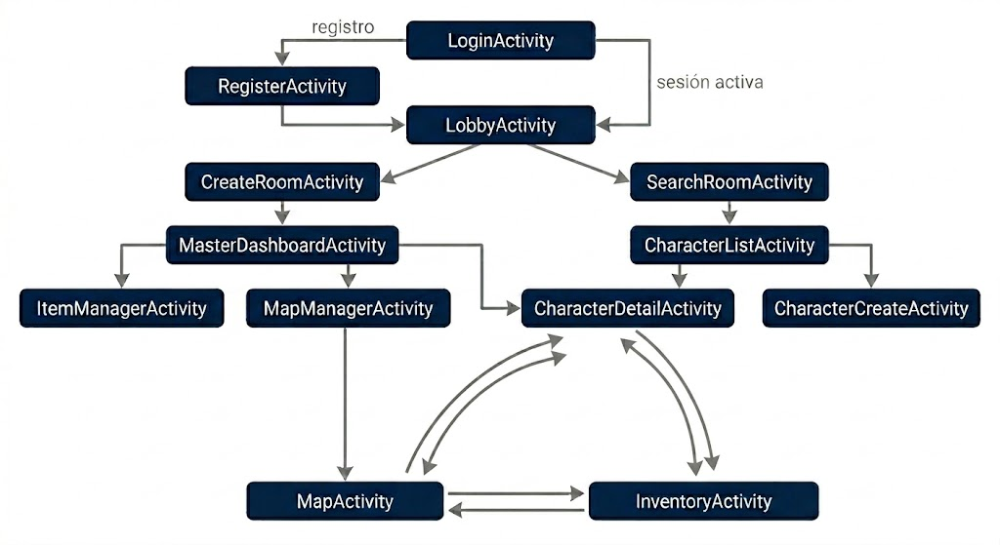
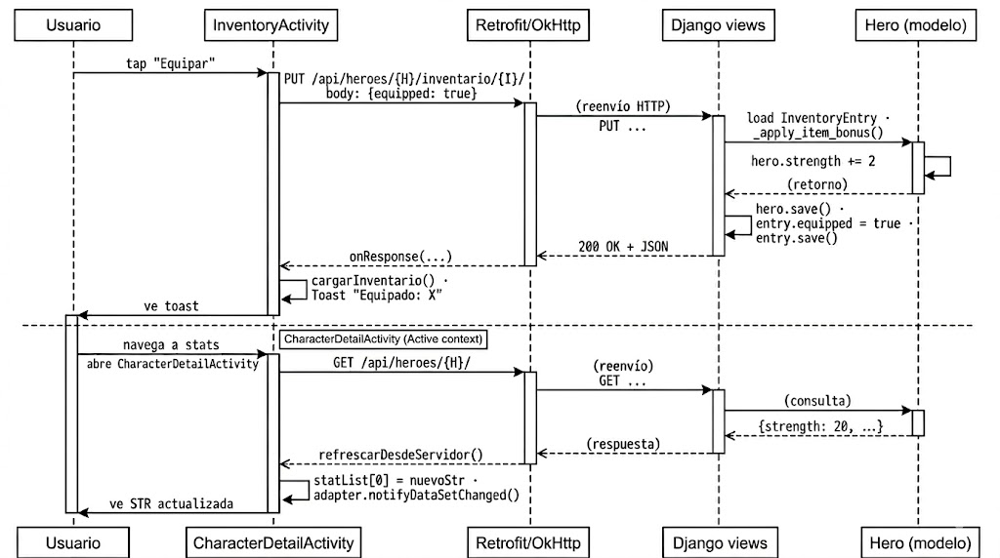
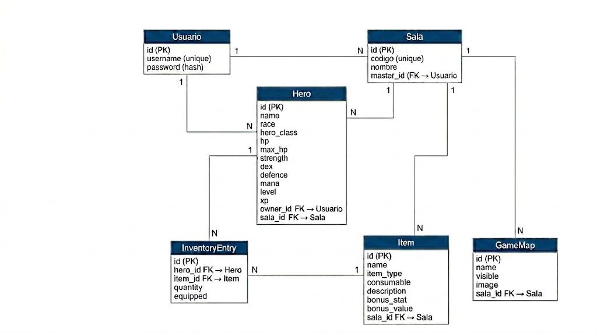
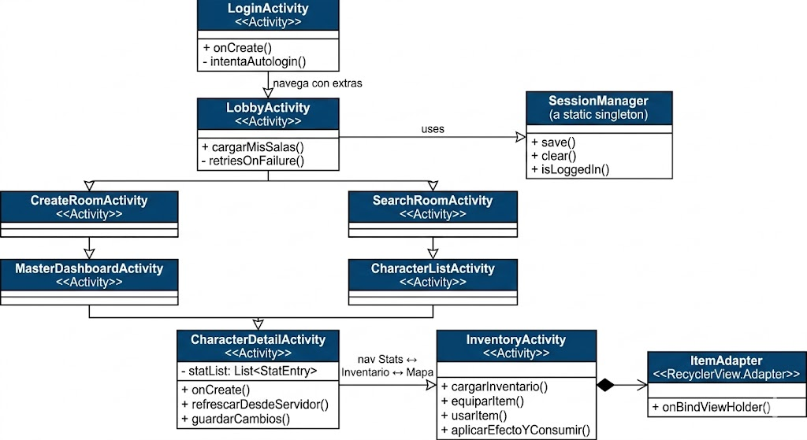

# Memoria del Proyecto Intermodular

## PixelDungeons — Companion App para Rol de Mesa

> Ciclo Formativo de Grado Superior — Desarrollo de Aplicaciones Multiplataforma (DAM)
> Curso 2025 / 2026
> Centro de Formación Profesional Afundación
>
> Entrega final — cliente Android + backend Django integrados
>
> Autor: David Formoso · Repositorio: https://github.com/FormosoCrl/PixelDungeons

---

## Índice

1. [Descripción del proyecto y ámbito de implantación](#1-descripción-del-proyecto-y-ámbito-de-implantación)
2. [Temporalización del proyecto y fases del desarrollo](#2-temporalización-del-proyecto-y-fases-del-desarrollo)
3. [Requisitos hardware y software](#3-requisitos-hardware-y-software)
4. [Arquitectura de la aplicación](#4-arquitectura-de-la-aplicación)
5. [Descripción de datos](#5-descripción-de-datos)
6. [Mejoras futuras](#6-mejoras-futuras)

---

## 1. Descripción del proyecto y ámbito de implantación

**PixelDungeons** es una aplicación Android pensada como *companion app* para partidas de rol de mesa. Su propósito es digitalizar la gestión de personajes, inventarios y mapas que tradicionalmente se hace con hoja de papel, dados y minis sobre la mesa, para que el ritmo de la partida no se vea interrumpido por trámites administrativos: equipar una armadura, recalcular stats, repartir un objeto, cambiar el mapa que ve el grupo o subir de nivel.

La aplicación se organiza en torno a dos roles:

- **Jugador**: crea héroes eligiendo raza y clase, se une a una sala mediante un código de 6 caracteres, lleva su hoja de personaje (HP, STR, DEX, DEF, MANA, level, xp) y su mochila. Equipa armas y armaduras (que aplican bonus a sus stats) y consume pociones (HP, fuerza, defensa, maná…). Ve en todo momento el mapa que el máster decide mostrar.
- **Game Master (GM)**: crea salas y comparte su código, define el catálogo de objetos de su mundo, sube mapas como imágenes y decide cuál es el visible, edita en directo las hojas de personaje (HP, stats, nivel y XP) y da o quita objetos del inventario de cualquier héroe. El sistema de niveles aplica automáticamente el crecimiento de stats según clase y raza al subir o bajar de nivel.

### 1.1 Usuarios objetivo

- Grupos de rol de mesa de 3 a 6 personas que quieran agilizar sus sesiones.
- Dungeon Masters que necesiten una herramienta sencilla para preparar contenido y compartirlo en directo con los jugadores.
- Jugadores que prefieran llevar su hoja en el móvil antes que en papel.

### 1.2 Tecnologías empleadas

| Capa | Tecnología |
|---|---|
| Cliente | Android nativo en Java |
| Interfaz | XML declarativo (`ConstraintLayout`, `RecyclerView`) |
| Tema | Material Design 3 con paleta personalizada y modo oscuro |
| Comunicación | Retrofit 2 + OkHttp sobre HTTP |
| Sistema de construcción | Gradle (Kotlin DSL, `.gradle.kts`) |
| Servidor | Django 6.0.5 sin `django-rest-framework` |
| Persistencia | SQLite gestionada por Django ORM |
| Servidor de aplicación | gunicorn 23 sobre Linux |
| Hosting | VPS con IP pública (`161.97.73.46:8000`) |
| API | REST propia con JSON, 13 endpoints |

### 1.3 Cambios respecto a la entrega parcial

En la entrega parcial el cliente Android era funcional pero todos los datos vivían en memoria. La entrega final añade:

1. Backend Django con 6 modelos y 13 endpoints REST, desplegado en un VPS.
2. Persistencia real: todo lo que el cliente lee y escribe va a la base de datos del servidor.
3. Autenticación real: registro y login con `make_password` / `check_password` de Django.
4. Sistema de salas: los héroes pertenecen a una sala, y la sala tiene un máster identificado. El jugador entra con un código.
5. Inventario por personaje: cada `Hero` tiene su propio `InventoryEntry` por cada `Item` que posee, con cantidad y estado de equipado por entrada.
6. Sistema de niveles: XP, subida automática al alcanzar el umbral, escalado de stats por clase + raza, y edición manual del nivel por parte del máster con escalado bidireccional.
7. Mapas compartidos: imágenes subidas en Base64 (reescaladas a máximo 400 px del lado más largo), uno visible a la vez por sala.

---

## 2. Temporalización del proyecto y fases del desarrollo

El desarrollo se ha planificado en **trece fases**. Las primeras siete corresponden al prototipo en memoria entregado en la fase parcial; las seis últimas, al backend Django, su despliegue y la integración del cliente con el servidor.

Para planificarlo usé **PERT/CPM**: con las dependencias entre fases calculé los tiempos más tempranos y tardíos de cada actividad, obtuve las holguras y vi qué fases no tienen margen de retraso. El Gantt recoge la misma información de forma visual.

### 2.1 Identificación de actividades y dependencias

| ID | Actividad | Predecesoras | Duración |
|----|-----------|--------------|----------|
| F1 | Análisis y diseño preliminar (requisitos, alcance, modelo de datos inicial) | — | 4 h |
| F2 | Maquetación XML + navegación entre Activities (pantallas base) | F1 | 8 h |
| F3 | Rol Jugador en memoria (lista, creación, hoja, mochila) | F2 | 10 h |
| F4 | Rol GM en memoria (dashboard, catálogo de objetos, gestor de mapas local) | F2 | 8 h |
| F5 | Sistema de equipamiento + bonus de stats + exclusividad por categoría | F3, F4 | 6 h |
| F6 | Pulido Material 3 + modo oscuro + empty states | F5 | 4 h |
| F7 | Estabilización y entrega parcial | F6 | 2 h |
| F8 | Modelos Django + migraciones + admin | F7 | 6 h |
| F9 | Implementación de los 13 endpoints REST (sin DRF) + autenticación con hash | F8 | 10 h |
| F10 | Despliegue del backend en VPS (gunicorn + apertura de puertos + supervisión del proceso) | F9 | 4 h |
| F11 | Integración cliente-servidor (sustituir repositorios estáticos por llamadas Retrofit) | F10 | 10 h |
| F12 | Features sobre la pila integrada: salas con códigos, sistema de niveles, mapas en Base64, persistencia de sesión | F11 | 12 h |
| F13 | Testing en dispositivo real + corrección de bugs + entrega final | F12 | 8 h |

Suma de horas de trabajo individuales: 92 h. La duración total del proyecto es de 84 h gracias al paralelismo entre F3 y F4.

### 2.2 Análisis PERT — tiempos y holguras

| ID | Actividad | D | ES | EF | LS | LF | H | Crítica |
|----|-----------|---|----|----|----|----|---|---------|
| F1 | Análisis y diseño | 4 | 0 | 4 | 0 | 4 | 0 | ✅ |
| F2 | Maquetación + navegación | 8 | 4 | 12 | 4 | 12 | 0 | ✅ |
| F3 | Rol Jugador (memoria) | 10 | 12 | 22 | 12 | 22 | 0 | ✅ |
| F4 | Rol GM (memoria) | 8 | 12 | 20 | 14 | 22 | 2 | — |
| F5 | Equipamiento + stats | 6 | 22 | 28 | 22 | 28 | 0 | ✅ |
| F6 | Pulido Material 3 | 4 | 28 | 32 | 28 | 32 | 0 | ✅ |
| F7 | Estabilización + entrega parcial | 2 | 32 | 34 | 32 | 34 | 0 | ✅ |
| F8 | Modelos Django | 6 | 34 | 40 | 34 | 40 | 0 | ✅ |
| F9 | Endpoints REST + auth | 10 | 40 | 50 | 40 | 50 | 0 | ✅ |
| F10 | Despliegue VPS | 4 | 50 | 54 | 50 | 54 | 0 | ✅ |
| F11 | Integración Retrofit | 10 | 54 | 64 | 54 | 64 | 0 | ✅ |
| F12 | Features post-integración | 12 | 64 | 76 | 64 | 76 | 0 | ✅ |
| F13 | Testing + bugs + entrega final | 8 | 76 | 84 | 76 | 84 | 0 | ✅ |

**Camino crítico:** F1 → F2 → F3 → F5 → F6 → F7 → F8 → F9 → F10 → F11 → F12 → F13, con duración total de **84 horas**.

**Actividad con holgura:** F4 (Rol GM en memoria) tiene una holgura de 2 horas porque F3, su paralela tras F2, dura 10 h frente a las 8 h de F4. F4 puede empezar a la vez que F3 y aún así terminar 2 h antes de que F5 pueda comenzar.

### 2.3 Diagrama PERT (notación AOA)

Cada nodo representa un evento con su número, tiempo más temprano (ET) y tiempo más tardío (LT), en formato `nº · ET | LT`. Las flechas representan las actividades F1–F13 con su duración en horas. Las actividades del camino crítico se marcan en rojo; F4, con holgura de 2 h, en naranja.



### 2.4 Diagrama de Gantt

Escala: 1 carácter = 2 horas; marcadores cada 8 horas. Las barras del camino crítico se marcan con bloque sólido `█`; la actividad con holgura (F4) con `░`.

```
Horas:  0   8   16  24  32  40  48  56  64  72  80
        │   │   │   │   │   │   │   │   │   │   │
F1      ██
F2        ████
F3            █████
F4            ░░░░
F5                 ███
F6                    ██
F7                      █     ← Entrega parcial (h=34)
F8                       ███
F9                          █████
F10                              ██
F11                                █████
F12                                     ██████
F13                                           ████   ← Entrega final (h=84)
        │   │   │   │   │   │   │   │   │   │   │
Horas:  0   8   16  24  32  40  48  56  64  72  80

█ = camino crítico (holgura 0)    ░ = actividad con holgura (F4: 2 h)
```

La duración total del proyecto es de **84 horas**. El paralelismo posible entre F3 y F4 — independientes entre sí tras F2 — evita acumular sus duraciones (10 + 8 = 18 h) y reduce el tramo a 10 h.

### 2.5 Retos encontrados y aprendizajes significativos

#### Reto 1 — Propagar el rol del usuario por la pila de Activities

La misma `Activity` se abre como Jugador o como Máster y debe presentar UIs distintas. La solución consistió en propagar un *flag* booleano `is_master` mediante `Intent.putExtra` en cada navegación. En `CharacterDetailActivity` esto va más lejos: en modo máster se reemplazan dinámicamente los `TextView` de los stats por `EditText` manteniendo el mismo `id`, de forma que el resto del código sigue encontrando la vista con `findViewById(R.id.hp_value)` sin enterarse del cambio. La clave técnica es copiar manualmente los `LayoutParams` de la vista original al construir el `EditText`, o se pierden las constraints definidas en el XML.

#### Reto 2 — Separar el catálogo del inventario real

El primer diseño tenía un único repositorio de items que actuaba como catálogo del GM y como mochila del jugador a la vez. Esto generaba comportamientos incoherentes: cuando el GM creaba un objeto, ese objeto aparecía en la mochila del jugador, y al equiparlo se equipaba globalmente. Se introdujo un segundo repositorio (`PlayerInventoryRepository`) encargado en exclusiva del inventario del jugador, separando responsabilidades. En el backend este diseño se concretó como dos tablas independientes: `Item` (catálogo por sala) y `InventoryEntry` (relación N:N enriquecida entre `Hero` e `Item`).

#### Reto 3 — Exclusividad de armas y armaduras

En el prototipo en memoria se implementó la regla "no puedes llevar dos armas a la vez" dentro del repositorio: al equipar un objeto de tipo Arma o Armadura, se recorría el inventario desequipando los del mismo tipo. Al pasar al backend se tomó la decisión de no portar esa restricción al servidor, dejando la responsabilidad en el máster, que es quien autoriza el catálogo y entrega los objetos.

#### Reto 4 — Cálculo de stats con equipamiento sin tocar el modelo `Hero`

En la fase en memoria, los stats efectivos del héroe se calculaban al vuelo en la pantalla de detalle, leyendo `PlayerInventoryRepository.getEquippedBonus(stat)` y sumándolo al valor base recibido por `Intent`. Así se evitaba mutar el `Hero` original, lo que habría introducido bugs si el item se desequipaba o se quitaba. Con la llegada del backend este enfoque cambió: ahora el servidor mantiene los stats efectivos en el propio modelo `Hero` y aplica/quita el bonus al togglear `equipped`, lo que simplifica el cliente.

#### Reto 5 — Estados vacíos

Una pantalla con un `RecyclerView` en blanco no transmite información al usuario, parece un bug. Se añadió un `TextView` oculto en cada lista que se muestra cuando la lista está vacía y se oculta cuando llega contenido. Se refresca en `onResume()` y tras cada acción que pueda cambiar el estado.

#### Reto 6 — Migración de "todo en memoria" a "todo en el servidor"

Este fue el reto técnico más grande de la entrega final. El cliente original asumía datos locales y de repente todo debía pasar por HTTP. Lo que parecía un *search & replace* (cambiar `HeroRepository.getHeroes()` por `ApiClient.getService().getHeroesDeSala(...)`) era en realidad un rediseño asíncrono. Las llamadas a Retrofit van en callbacks y no devuelven datos al instante, lo que obligó a repensar tres cosas:

- **Cuándo cargar:** todas las listas refrescan ahora en `onResume()`, no en `onCreate()`. Si el usuario se marcha y vuelve, ve los cambios del servidor.
- **Qué hacer mientras carga:** se opta por dejar las pantallas con el estado anterior visible y machacarlo cuando llega la respuesta. Es menos limpio que un spinner pero evita parpadeos.
- **Qué pasa si falla:** se implementó un retry con back-off de 800 ms y máximo 3 intentos en cada pantalla que carga listas, porque el backend (gunicorn detrás de keep-alive) cerraba conexiones a los ~2 segundos. Más tarde se arregló en el cliente forzando `Connection: close` en OkHttp.

#### Reto 7 — Bug del sistema de bonus de equipamiento

Al revisar el flujo end-to-end de equipar un objeto se detectó que el bonus no se aplicaba: el endpoint `inventario_item` PUT cambiaba el flag `equipped=true/false` en la tabla intermedia pero nunca tocaba los stats del héroe. Los datos llegaban al backend correctamente pero ninguna función los aplicaba al modelo `Hero`. Lo mismo ocurría con las pociones de stat consumibles: `aplicarEfectoYConsumir` en el cliente solo manejaba HP y se comía las pociones de fuerza o defensa sin producir efecto.

Se añadió el helper `_apply_item_bonus(hero, item, sign)` en el backend, simétrico para equipar y desequipar, con clamps a 0 (stats) y 1 (max_hp). En el frontend se extendió el `switch` del consumo para soportar todos los stats (hp, str, dex, def, mana) en lugar de solo HP. El detalle del fix está en la sección 5.

#### Reto 8 — Bugs encontrados en el testing final

Una revisión sistemática del código tras la integración sacó cinco bugs adicionales:

1. **Toast invertido al equipar:** `InventoryActivity.equiparItem` leía `item.isEquipped()` tras el toggle, por lo que el toast mostraba siempre lo contrario de la acción realizada.
2. **Mapas distorsionados:** `MapManagerActivity.uriToBase64` forzaba todas las imágenes a 400×400 sin respetar el aspect ratio.
3. **Stack tras cerrar sala:** `MasterDashboardActivity.volverAlLobby` usaba solo `CLEAR_TOP`, así que pulsar Atrás desde el lobby volvía al dashboard de una sala ya borrada.
4. **Raza sin efecto al crear:** los stats iniciales solo dependían de la clase, contradiciendo el texto del spinner ("Humano +todo", "Elfo +DEX/+MANA"…). Se añadió `applyRaceBase(stats, race)`.
5. **Bonus negativos ocultos:** `ItemAdapter` solo mostraba la línea de bonus cuando era `> 0`. Pociones con valor negativo (veneno, debuffs) quedaban invisibles aunque el backend las aplicara.

Todos los fixes están en la versión final, detallados parcialmente en la sección 5.

---

## 3. Requisitos hardware y software

### 3.1 Requisitos del entorno de desarrollo

| Componente | Mínimo recomendado | Equipo utilizado |
|---|---|---|
| Sistema operativo | Windows 10 (64 bits) / Ubuntu 22.04 / macOS 12 | Windows 11 Pro 23H2 |
| Procesador | x86_64 de 4 núcleos a 2.5 GHz | Intel Core i7-13650HX (13.ª Gen, 14 núcleos / 20 hilos, 4.9 GHz turbo) |
| Memoria RAM | 8 GB | 32 GB DDR5 4800 MT/s |
| Almacenamiento | 20 GB libres | SSD NVMe 1 TB (Micron 2400) |
| Tarjeta gráfica | GPU compatible con OpenGL ES 3.0 (requerida por el emulador de Android Studio con aceleración hardware) | NVIDIA GeForce RTX 4060 Laptop GPU (8 GB GDDR6) |
| Conectividad | Wi-Fi 802.11n o Ethernet 100 Mbps | Wi-Fi 6E (AX1800) + Ethernet 1 Gbps |
| Emulador / dispositivo | AVD compatible con API 24+ o teléfono físico con depuración USB | AVD Pixel 7 (API 35) + Samsung Galaxy A52 físico (Android 13) |

### 3.2 Software de desarrollo

| Software | Versión usada |
|---|---|
| Android Studio | Narwhal 3 Feature Drop (2025.1.3) |
| Android Gradle Plugin (AGP) | 8.13.2 |
| Gradle | 8.x (vía wrapper del proyecto) |
| Java (source/target del cliente) | Java 11 |
| JDK usado para compilar | OpenJDK 24 (Adoptium) |
| Android SDK | `minSdk = 24` (Android 7.0), `targetSdk = 36` |
| `androidx.appcompat` | 1.7.1 |
| `androidx.constraintlayout` | 2.2.1 |
| `com.google.android.material` | 1.13.0 |
| Retrofit | 2.x |
| OkHttp | 4.x |
| Gson | 2.x (`retrofit2-converter-gson`) |
| Python | 3.10+ |
| Django | 6.0.5 (sin `django-rest-framework`) |
| gunicorn | 23.0.0 |
| SQLite | 3 (incluido en Django) |
| Git | 2.40+ |
| draw.io (diagrams.net) | desktop 24.x |

Las versiones exactas del catálogo Android están centralizadas en `gradle/libs.versions.toml`; las del backend, en `PixelDungeons-BackEnd/requirements.txt`.

### 3.3 Requisitos del dispositivo Android del usuario final

| Componente | Mínimo | Recomendado |
|---|---|---|
| Versión de Android | 7.0 (API 24) | 12 o superior (API 31+) |
| Memoria RAM | 2 GB | 4 GB o más |
| Espacio libre | 100 MB | 200 MB |
| Resolución | 720 × 1280 px (HD) | 1080 × 2400 px (Full HD+) |
| Tarjeta gráfica | GPU compatible con OpenGL ES 2.0 | GPU compatible con OpenGL ES 3.2 |
| Conectividad | Wi-Fi 802.11n o datos móviles 3G | Wi-Fi 802.11ac o datos móviles 4G/5G |

El cliente requiere conexión a internet para hablar con el backend; no funciona en modo offline.

### 3.4 Requisitos del servidor (producción)

| Componente | Mínimo | Producción actual |
|---|---|---|
| Sistema operativo | Linux Ubuntu 22.04 LTS o equivalente | Linux (VPS contratado) |
| Procesador | x86_64 de 1 vCPU a 2 GHz | VPS de gama básica |
| Memoria RAM | 1 GB | ≥ 2 GB |
| Almacenamiento | 5 GB libres | ≥ 20 GB |
| Tarjeta gráfica | N/A | N/A |
| Conectividad | Salida pública con IP estática, puerto 8000 abierto | IP pública `161.97.73.46`, puerto 8000 expuesto |
| Python | 3.10+ | 3.10+ |
| Django | 4.2 LTS o superior | 6.0.5 |
| WSGI | Cualquier servidor WSGI (gunicorn, uWSGI…) | gunicorn 23.0.0 |
| Base de datos | SQLite o PostgreSQL 14+ | SQLite |

---

## 4. Arquitectura de la aplicación

### 4.1 Visión general

La aplicación es un sistema cliente-servidor sobre HTTP/JSON:



### 4.2 Arquitectura del cliente — patrón Repository + Activity

El cliente Android organiza el código en cuatro paquetes:

```
com.example.pixeldungeons
├── ui/             Activities, Adapters, helpers de tema y sesión
│   └── adapter/    RecyclerView adapters
├── network/        ApiClient + ApiService (Retrofit)
├── model/          POJOs del dominio (Hero, Item, GameMap, StatItem)
└── data/           Repositorios estáticos (heredados del prototipo)
```

El enunciado del proyecto deja MVVM como opcional. En esta aplicación, donde las Activities consumen llamadas REST y pintan el resultado, MVVM añadía dos capas (ViewModel, LiveData/Flow) sin aportar claridad. Se optó por un patrón **Repository + Activity simplificado**: cada Activity llama directamente a `ApiClient.getService().xxx().enqueue(...)`, parsea el JSON con Gson dentro del callback y pinta el resultado.

Esta decisión prioriza la legibilidad y la velocidad de iteración sobre la pureza arquitectónica, lo cual encaja con el alcance del proyecto. Para un sistema con caché offline, transformaciones complejas o múltiples fuentes de datos, MVVM con Room y ViewModels sería más apropiado.

### 4.3 Pantallas del cliente y navegación

El cliente cuenta con **13 Activities** que cubren los dos roles:

| # | Activity | Rol | Función |
|---|----------|-----|---------|
| 1 | `LoginActivity` | Común | Login. Si hay sesión guardada, salta directo al lobby. |
| 2 | `RegisterActivity` | Común | Registro de usuario nuevo. |
| 3 | `LobbyActivity` | Común | Lista las salas que se han creado (modo máster) + botones Crear/Buscar. |
| 4 | `CreateRoomActivity` | Máster | Crea sala y genera código de 6 caracteres. |
| 5 | `SearchRoomActivity` | Jugador | Busca sala por código. |
| 6 | `MasterDashboardActivity` | Máster | Lista de personajes de la sala + acceso al gestor de items y mapas + cerrar sala. |
| 7 | `CharacterListActivity` | Jugador | Lista de personajes propios en la sala. |
| 8 | `CharacterCreateActivity` | Jugador | Crear personaje eligiendo raza y clase. |
| 9 | `CharacterDetailActivity` | Común | Hoja de personaje (lectura para jugador, editable para máster). |
| 10 | `InventoryActivity` | Común | Mochila del personaje. Acciones según rol. |
| 11 | `MapActivity` | Común | Mapa visible de la sala con pinch-to-zoom y pan. |
| 12 | `ItemManagerActivity` | Máster | Catálogo de objetos de la sala. |
| 13 | `MapManagerActivity` | Máster | Galería de mapas; marca cuál es el visible. |

**Diagrama de navegación abreviado:**



### 4.4 Diagrama de secuencia — equipar un objeto



### 4.5 Arquitectura del servidor

El backend es una aplicación Django (sin `django-rest-framework`, como exige el enunciado) servida por gunicorn detrás del puerto 8000 del VPS. La estructura del proyecto es deliberadamente plana:

```
PixelDungeons-BackEnd/
├── manage.py
├── requirements.txt
├── db.sqlite3
├── pixeldungeons_backend/        ← proyecto Django
│   ├── settings.py
│   ├── urls.py                   ← incluye api.urls
│   └── wsgi.py
└── api/                          ← única app
    ├── models.py                 ← 6 modelos
    ├── views.py                  ← 13 vistas (~400 líneas)
    ├── urls.py                   ← 13 rutas
    └── migrations/
```

La consecuencia práctica de no usar DRF es que cada vista parsea el JSON a mano con `json.loads(request.body)` y devuelve `JsonResponse(...)`. No hay serializers ni viewsets, sino funciones con `if request.method == 'GET' / elif … DELETE`. Es más verboso, pero también más explícito.

Se ha elegido **SQLite** como base de datos porque la carga esperada es muy baja (un grupo de rol equivale a 5 conexiones simultáneas como máximo), va sobrada para esta carga y simplifica el despliegue (un único archivo). Si fuera necesario escalar a miles de partidas, migrar a PostgreSQL implicaría cambiar una sola sección de `settings.py`.

Se usa **gunicorn** como servidor WSGI porque `python manage.py runserver` solo es válido para desarrollo. Para desplegarlo se clona el repo en el VPS, se ejecuta `pip install -r requirements.txt`, `python manage.py migrate` y se lanza con `gunicorn pixeldungeons_backend.wsgi:application --bind 0.0.0.0:8000`. Para que el proceso sobreviva a desconexiones de SSH se puede dejar bajo un supervisor (`nohup`, `tmux`/`screen` o un servicio del sistema).

### 4.6 Diagrama Entidad-Relación



| Relación | Cardinalidad | Implementación |
|---|---|---|
| Usuario → Sala (como máster) | 1:N | FK `master_id` en `Sala` |
| Usuario → Hero (como dueño) | 1:N | FK `owner_id` en `Hero` |
| Sala → Hero | 1:N | FK `sala_id` en `Hero` |
| Sala → Item | 1:N | FK `sala_id` en `Item` |
| Sala → GameMap | 1:N | FK `sala_id` en `GameMap` |
| **Hero ↔ Item** | **N:N enriquecida** | Tabla intermedia `InventoryEntry` con atributos `quantity` y `equipped` |

La relación N:N entre `Hero` e `Item` está enriquecida con atributos propios (`quantity`, `equipped`), por lo que se modela como tabla intermedia explícita y no como `ManyToManyField` plano. Es esta tabla la que permite que un mismo ítem del catálogo aparezca en el inventario de varios héroes con cantidades y estados de equipamiento independientes.

### 4.7 Fachada REST — endpoints

| # | Método | Ruta | Parámetros | Cuerpo | Función |
|---|--------|------|------------|--------|---------|
| 1 | POST | `/api/registro/` | — | `{username, password}` | Registro de usuario |
| 2 | POST | `/api/login/` | — | `{username, password}` | Login |
| 3 | GET | `/api/salas/` | query `?codigo=` (opcional) | — | Lista salas o busca por código |
| 4 | POST | `/api/salas/` | — | `{codigo, nombre, master_id}` | Crear sala |
| 5 | DELETE | `/api/salas/<sala_id>/` | path `sala_id` | — | Cerrar sala |
| 6 | GET | `/api/salas/<sala_id>/heroes/` | path `sala_id` | — | Lista héroes de una sala |
| 7 | POST | `/api/heroes/` | — | `{name, race, hero_class, stats…, owner_id, sala_id}` | Crear héroe |
| 8 | GET, PUT, DELETE | `/api/heroes/<hero_id>/` | path `hero_id` | PUT: stats parciales | Consultar, editar o borrar héroe |
| 9 | GET, POST | `/api/heroes/<hero_id>/inventario/` | path `hero_id` | POST: `{item_id, quantity}` | Inventario / dar item |
| 10 | PUT, DELETE | `/api/heroes/<hero_id>/inventario/<item_id>/` | path `hero_id`, `item_id` | PUT: `{equipped o quantity}` | Equipar, desequipar o quitar |
| 11 | GET, POST | `/api/items/` | query `?sala_id=`, `?tipo=` | POST: catálogo | Catálogo de items por sala |
| 12 | DELETE | `/api/items/<item_id>/` | path `item_id` | — | Borrar item del catálogo |
| 13 | GET, POST | `/api/salas/<sala_id>/mapas/` | path `sala_id` | POST: `{name, image_base64}` | Listar / crear mapas |
| 14 | GET, PUT, DELETE | `/api/mapas/<mapa_id>/` | path `mapa_id` | PUT: `{visible o image…}` | Detalle de mapa |

El paso de parámetros combina las tres formas que ofrece HTTP: **path** para los identificadores de recurso (`<int:sala_id>`, `<int:hero_id>`…), **query** para filtros opcionales (`?codigo=`, `?sala_id=`, `?tipo=`) y **body** en los POST y PUT. El intercambio es siempre JSON mediante `JsonResponse`.

### 4.8 UML del cliente — clases principales



**Modelos (`model/`):** `Hero`, `Item`, `GameMap`, `StatItem` — POJOs con getters/setters; representan en memoria lo que devuelve la API.

**Capa de red (`network/`):**
- `ApiService` — interfaz Retrofit con las 13 llamadas anotadas (`@GET`, `@POST`, `@PUT`, `@DELETE`, `@Path`, `@Query`, `@Body`).
- `ApiClient` — singleton perezoso que construye el `Retrofit` configurado con un `OkHttpClient` (timeouts, `Connection: close`).

---

## 5. Descripción de datos

### 5.1 Modelo `InventoryEntry` — relación N:N enriquecida

```python
class InventoryEntry(models.Model):
    hero = models.ForeignKey(Hero, on_delete=models.CASCADE,
                             related_name='inventory')
    item = models.ForeignKey(Item, on_delete=models.CASCADE)
    quantity = models.IntegerField(default=1)
    equipped = models.BooleanField(default=False)
```

Tipos de los atributos:

| Atributo | Tipo Django | Justificación |
|---|---|---|
| `hero`, `item` | `ForeignKey` | Relaciones obligatorias; sin ambas la entrada no tiene sentido |
| `quantity` | `IntegerField` | Cantidades enteras (no hay fracciones de poción) |
| `equipped` | `BooleanField` | Estado binario por entrada |

`on_delete=CASCADE` en las dos FKs: si se borra el héroe, su inventario se va con él; si se borra el item del catálogo, las entradas de inventario que lo referenciaban también. Es coherente con el dominio: un objeto que el máster elimina deja de existir en el mundo.

No se usa `ManyToManyField` porque la tabla intermedia tiene atributos propios (`quantity`, `equipped`), lo que obliga a modelarla como modelo explícito.

### 5.2 `_apply_item_bonus` e `inventario_item` — sistema de equipamiento

```python
def _stat_field(stat_key):
    """Mapea la clave del bonus_stat al nombre real del campo en Hero."""
    return {
        'str':  'strength',
        'dex':  'dex',
        'def':  'defence',
        'mana': 'mana',
        'hp':   'max_hp',
    }.get(stat_key)


def _apply_item_bonus(hero, item, sign=1):
    """Aplica (sign=+1) o quita (sign=-1) el bonus de un item al héroe.
    Simétrico: equipar y desequipar se cancelan exactamente."""
    field = _stat_field(item.bonus_stat)
    if field is None or item.bonus_value == 0:
        return
    delta = sign * item.bonus_value
    if field == 'max_hp':
        hero.max_hp = max(1, hero.max_hp + delta)
        hero.hp = max(0, min(hero.hp + delta, hero.max_hp))
    else:
        new_val = max(0, getattr(hero, field) + delta)
        setattr(hero, field, new_val)


@csrf_exempt
def inventario_item(request, hero_id, item_id):
    try:
        entry = InventoryEntry.objects.get(hero_id=hero_id, item_id=item_id)
    except InventoryEntry.DoesNotExist:
        return JsonResponse({'error': 'Entrada no encontrada'}, status=404)

    if request.method == 'PUT':
        data = _body(request)
        if 'equipped' in data:
            new_equipped = bool(data['equipped'])
            if new_equipped != entry.equipped:
                _apply_item_bonus(entry.hero, entry.item,
                                  sign=(1 if new_equipped else -1))
                entry.hero.save()
            entry.equipped = new_equipped
        if 'quantity' in data:
            entry.quantity = data['quantity']
        entry.save()
        return JsonResponse({'item_id': item_id,
                             'equipped': entry.equipped,
                             'quantity': entry.quantity})

    if request.method == 'DELETE':
        if entry.equipped:
            _apply_item_bonus(entry.hero, entry.item, sign=-1)
            entry.hero.save()
        entry.delete()
        return JsonResponse({'ok': True})

    return JsonResponse({'error': 'Método no permitido'}, status=405)
```

Tipos clave:

| Atributo / parámetro | Tipo | Función |
|---|---|---|
| `stat_key`, `field` | `str` | Clave de stat en formato corto y nombre del campo en el modelo |
| `sign` | `int` (+1 / −1) | Permite que la misma función equipe y desequipe sin duplicar lógica |
| `delta` | `int` | El cambio efectivo aplicado al stat |
| `entry.equipped`, `new_equipped` | `bool` | Estado actual de la BD vs. estado pedido por el cliente |

Pseudocódigo del flujo PUT:

```
si llega body con 'equipped':
    nuevo ← bool(body['equipped'])
    si nuevo ≠ entry.equipped:
        si nuevo es True:  aplicar_bonus(+1)
        si nuevo es False: aplicar_bonus(−1)
        guardar héroe
    entry.equipped ← nuevo
si llega body con 'quantity':
    entry.quantity ← body['quantity']
guardar entry
```

`_apply_item_bonus` es simétrica: llamarla con `sign=+1` y después con `sign=-1` deja el héroe exactamente como estaba. Esto impide que equipar y desequipar repetidamente acumule errores o que aparezcan bonus fantasma cuando se borra un item equipado (en el `DELETE` se llama con `sign=-1` antes del `entry.delete()`).

### 5.3 `apply_level_up` y la subida automática de nivel

```python
CLASS_GROWTH = {
    'Guerrero':  {'max_hp': 8,  'strength': 3, 'dex': 1, 'defence': 2, 'mana': 0},
    'Arquero':   {'max_hp': 5,  'strength': 2, 'dex': 3, 'defence': 1, 'mana': 1},
    'Mago':      {'max_hp': 3,  'strength': 0, 'dex': 1, 'defence': 1, 'mana': 4},
    # ...
}

RACE_GROWTH = {
    'Humano':  {'max_hp': 2, 'strength': 1, 'dex': 1, 'defence': 1, 'mana': 1},
    'Elfo':    {'max_hp': 0, 'strength': 0, 'dex': 2, 'defence': 0, 'mana': 2},
    # ...
}

def xp_to_next(level):
    """Curva de XP: 50 * n * (n+1).  N1→N2: 100xp, N2→N3: 300xp..."""
    return 50 * level * (level + 1)

def apply_level_up(h):
    """Aplica el crecimiento de stats de UN nivel según clase + raza."""
    cls = CLASS_GROWTH.get(h.hero_class, {})
    rac = RACE_GROWTH.get(h.race, {})
    hp_gain = cls.get('max_hp', 0) + rac.get('max_hp', 0)
    h.max_hp += hp_gain
    h.hp += hp_gain
    h.strength += cls.get('strength', 0) + rac.get('strength', 0)
    h.dex      += cls.get('dex',      0) + rac.get('dex',      0)
    h.defence  += cls.get('defence',  0) + rac.get('defence',  0)
    h.mana     += cls.get('mana',     0) + rac.get('mana',     0)
```

Dentro del PUT de `hero_detalle`:

```python
# Subida automática por XP: si la XP supera el umbral, sube nivel
# arrastrando el sobrante y aplica el growth. Cada nivel exige más XP.
while h.xp >= xp_to_next(h.level):
    h.xp -= xp_to_next(h.level)
    h.level += 1
    apply_level_up(h)
```

El crecimiento está en dos diccionarios separados (clase + raza) en vez de un único diccionario combinado: un Guerrero Orco crece distinto a un Guerrero Elfo, y mantenerlo en dos tablas significa 6 + 5 = 11 entradas en lugar de 6 × 5 = 30. El bucle `while` permite subir varios niveles a la vez cuando un héroe gana mucha XP de golpe (por ejemplo, al matar un enemigo importante); la XP sobrante se arrastra al siguiente nivel y no se pierde.

### 5.4 `aplicarEfectoYConsumir` — uso de pociones en el cliente

```java
private void aplicarEfectoYConsumir(Item item, Map<String, Object> hero) {
    String stat = item.getBonusStat();
    int bonus   = item.getBonusValue();

    Map<String, Object> statBody = new HashMap<>();
    if (bonus != 0 && stat != null) {
        switch (stat) {
            case "hp": {
                int hp    = ((Number) hero.get("hp")).intValue();
                int maxHp = ((Number) hero.get("max_hp")).intValue();
                statBody.put("hp", Math.max(0, Math.min(hp + bonus, maxHp)));
                break;
            }
            case "str": {
                int s = ((Number) hero.get("strength")).intValue();
                statBody.put("strength", Math.max(0, s + bonus));
                break;
            }
            case "dex":  /* análogo a str */ break;
            case "def":  /* análogo a str */ break;
            case "mana": /* análogo a str */ break;
        }
    }
    // … Runnable consumir() que hace PUT (quantity-1) o DELETE si era 1
    if (!statBody.isEmpty()) {
        ApiClient.getService().actualizarHero(heroId, statBody)
                .enqueue(callback_que_llama_a_consumir);
    } else {
        consumir.run();
    }
}
```

El método lee `bonus_stat` y `bonus_value` del item. Si no son neutros, construye un body PUT con el stat correspondiente, clampado (HP nunca por encima de `max_hp` ni por debajo de 0) y, en su callback, ejecuta el `consumir` (que decrementa la cantidad o borra la entrada). Si el bonus es neutro (caso de un item sin efecto mecánico, como "agua"), el método salta el PUT y solo consume.

El orden es deliberado: primero el efecto, después el consumo. Si la red falla a mitad del efecto, el item no se gasta. La contrapartida es una race condition documentada en mejoras futuras: si el PUT del efecto tiene éxito pero el del consumo falla, el héroe se cura pero la poción no se descuenta.

### 5.5 `refrescarDesdeServidor` — sincronización tras cambios remotos

```java
private void refrescarDesdeServidor(int heroId, boolean isMaster) {
    ApiClient.getService().getHero(heroId).enqueue(new Callback<Map<String, Object>>() {
        @Override
        public void onResponse(Call<Map<String, Object>> call,
                               Response<Map<String, Object>> response) {
            if (!response.isSuccessful() || response.body() == null) return;
            Map<String, Object> h = response.body();
            int newStr = ((Number) h.get("strength")).intValue();
            int newDex = ((Number) h.get("dex")).intValue();
            int newDef = ((Number) h.get("defence")).intValue();
            // …

            statList.set(0, new StatItem("Fuerza (STR)", newStr));
            statList.set(1, new StatItem("Destreza (DEX)", newDex));
            statList.set(2, new StatItem("Defensa (DEF)", newDef));
            statList.set(3, new StatItem("Mana", newMana));
            statAdapter.notifyDataSetChanged();
            // … actualizar HP, XP, level (TextView o EditText según rol)
        }
        @Override
        public void onFailure(...) { /* silencioso */ }
    });
}
```

El método se añadió tras detectar que la pantalla de stats mostraba los valores cacheados del `Intent` y no reflejaba los cambios que el backend acababa de hacer al equipar un objeto. El patrón consiste en pintar primero lo que llega por `Intent` (rápido, no parpadea) y luego pedir los datos al servidor y machacarlos cuando lleguen.

La respuesta de Retrofit con `Map<String, Object>` deja todos los números como `Double` (por cómo deserializa Gson), por lo que el cast es `((Number) h.get(...)).intValue()` en lugar de `(Integer)`.

### 5.6 `applyRaceBase` — stats iniciales por raza

```java
private void applyRaceBase(int[] stats, String race) {
    int[] mod;
    switch (race) {
        case "Humano":  mod = new int[]{ 5, 1, 1, 1, 1}; break;
        case "Elfo":    mod = new int[]{ 0, 0, 3, 0, 3}; break;
        case "Enano":   mod = new int[]{ 8, 1, 0, 3, 0}; break;
        case "Orco":    mod = new int[]{ 6, 3, 0, 1, 0}; break;
        case "Mediano": mod = new int[]{ 2, 0, 3, 2, 0}; break;
        default:        return;
    }
    for (int i = 0; i < stats.length && i < mod.length; i++) {
        stats[i] = Math.max(0, stats[i] + mod[i]);
    }
}
```

El array sigue el orden `[hp, str, dex, def, mana]`, el mismo que devuelve `generateStatsForClass()`, por lo que la suma elemento a elemento es directa. Se usa `switch` con arrays en lugar de un `Map<String, int[]>` porque son cinco entradas conocidas en *compile-time*; un mapa exigiría inicialización estática y resultaría menos legible para este caso. El clamp `Math.max(0, …)` es defensivo: ningún modificador es negativo hoy, pero impide stats negativos si en el futuro se añaden razas con penalizaciones.

Con este fix, lo que muestra el spinner ("Humano +todo", "Elfo +DEX/+MANA"…) coincide con los stats reales del personaje recién creado.

### 5.7 Reemplazo dinámico de `TextView` por `EditText`

```java
private void replaceWithEditText(TextView source, int inputType) {
    ViewGroup parent = (ViewGroup) source.getParent();
    int index = parent.indexOfChild(source);
    ViewGroup.LayoutParams params = source.getLayoutParams();

    EditText edit = new EditText(this);
    edit.setId(source.getId());                             // mantiene el id
    edit.setText(source.getText());                         // copia el texto
    edit.setTextColor(source.getCurrentTextColor());        // copia color
    edit.setTextSize(TypedValue.COMPLEX_UNIT_PX, source.getTextSize());
    edit.setInputType(inputType);
    edit.setGravity(android.view.Gravity.CENTER);
    edit.setLayoutParams(params);

    parent.removeView(source);
    parent.addView(edit, index);
}
```

El layout XML está pensado para mostrar `TextView` estáticos. Cuando el máster abre la pantalla, los stats deben ser editables. En lugar de duplicar el layout (uno para jugador y otro para máster), se reemplazan las vistas en runtime preservando el `id`, de modo que `findViewById(R.id.hp_value)` sigue funcionando aunque ahora devuelva un `EditText`. Se copian además el texto, color, tamaño, alineación y, especialmente, los `LayoutParams`, sin los cuales se perderían las constraints definidas en el XML.

---

## 6. Mejoras futuras

1. **Indicador de carga.** Las pantallas refrescan en silencio. Un `ProgressBar` en el toolbar mientras hay petición en vuelo mejoraría la sensación cuando la red tarda.
2. **Pantalla de dado D20 dentro de la navegación del jugador.** Incorporar una cuarta pantalla a la barra inferior del jugador (Stats / Inventario / Mapa) con un dado D20 virtual que devuelva un número aleatorio al pulsarlo, evitando que el jugador tenga que recurrir a un dado físico o a una app externa durante la partida.
3. **Endpoint `PUT /api/items/<id>/`.** Hoy el catálogo solo permite crear o borrar items; para corregir un item con datos erróneos hay que borrarlo y recrearlo, lo que cascade-elimina las entradas de inventario.
4. **Validación defensiva en auto-login.** Si la cuenta de un usuario se elimina, el cliente sigue creyendo que la sesión sigue activa. Una comprobación al primer 401/404 que llegue debería cerrar sesión y volver al login.
